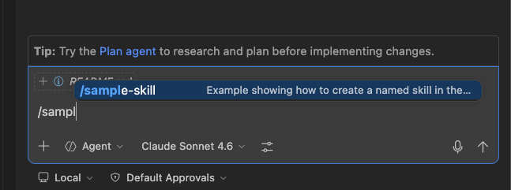
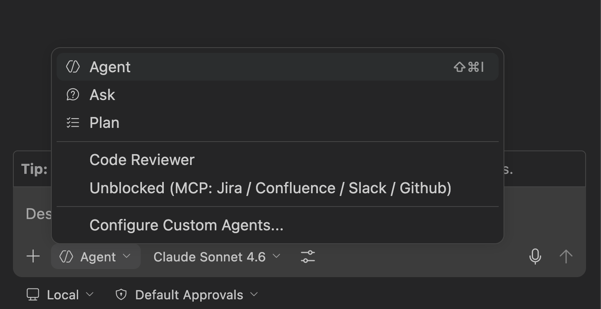
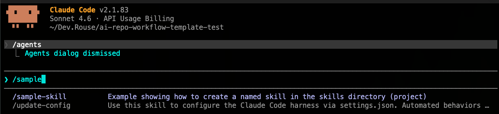
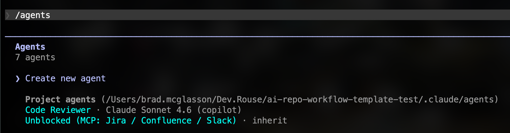

# ai-toolkit
AI Toolkit for Shared Skills, Agents and workflow walkthroughs for getting the most out of our shared Github Copilot & Claude Code Usage. 

**IMPORTANT COPILOT NOTES:** : 
- We only symlink in `.claude/skills` and `.claude/agents` - **NOT** any `.copilot/*` folders - Copilot sees `.claude` folders natively. 
- Copilot + Claude both read `AGENTS.md` now, meaning you **DO NOT** need a `copilot-instructions.md`

One could argue to do them all in `.claude` but having a unified global lets you utilize ad-hoc tools in similar fashion to whats demo'd here. 

<br>
<br>

## INITIAL SETUP
1. In project root, run...  

```bash
bash ai-setup.sh
```
*OR - ask AI to do the symlinking!*

```markdown
Please symlink this projects `.claude/skills` to the `.skills` folder and the `.claude/agent` to `.agents`.
```

This symlinks: 
- `.claude/skills` --> `.skills` 
- `.claude/agents` --> `.agents` 

*NOTE: Symlinks are local-only and should be added to .gitignore and NOT COMMITTED - see the  .gitignore file for example.*

<br>
<br>

## WORKFLOW - SINGLE REPO
```
# PROJECT-LEVEL REPO ROOT

.agents/                       # Unified Repo Agents Directory
├── <agent-name>.agent.md         # Single Agent File
├── README.md                     # Template & Explanation
|
.skills/                       # Unified Skills Directory
├── <skill-name>/
|   ├─- sample-script.sh          # Related files for skill
│   └── SKILL.md                  # Skill definition itself
|
├── AGENTS.md                  # Copilot / Claude read this as core instructions
|
.claude/skills → ../.skills       # Symlink (ask AI to symlink or use ai-setup.sh)
.claude/agents → ../.agents       # Symlink (ask AI to symlink or use ai-setup.sh)
```

<br>

## WHY? 
*Unified `Skill` commands and `Agents` means everyone can build with AI tools together while having flexibility on which platform they prefer - Copilot or Claude Code*

*While both platforms - with some instruction - can usually find their way to tools, working with the `/slash` command paradigm is a particularly nice workflow we've found.*

<br>
<br>

## WORKFLOW - GLOBAL USAGE
The same pattern for one repo from above also works in your globally accessbile claude/copilot folders across repos as well for *“anywhere access”* by doing the same symlink flow, but with a few caveats.

### TL;DR - EASY MODE : 
Run this from within this repo workspace
```
/symlink-global link this repos skills and agents please`
```

This skill will set up the symlinks in the tree shown below for you, and can be reused after that globally in any other repo you happen to want to link skills or agents from after that point.
 

### WORKFLOW DIAGRAM:
```
# Location : User Root (~/ folder in Mac OS)

  .agents/                      # Global Agents Directory
    ├── code-reviewer.agent.md     # Symlink → ai-toolkit/agents/code-reviewer.agent.md
    ├── another.agent.md           # Symlink → sample-repo/agents/another.agent.md
    |
    |
  .skills/                     # Global Skills Directory
    ├── sample-skill/		       # Symlink → ai-toolkit/skills/sample-skill/
    |
    |
  .claude/skills → ~/.skills       # Symlinked, read by Copilot & Claude
  .claude/agents → ~/.agents       # Symlinked, read by Copilot & Claude

```

<br>

*As was the case in the repo level, Copilot reads the `.claude/skills` and `.claude/agents` global folders so this skill doesn't bother setting those up as they're irrelevant.*


<br>

## GITHUB COPILOT
**IMPORTANT**: When adding new agents to our symlinked directory, restart VS Code if you do not see it appear in your list upon creation.

### Skills:
- Use skills with `/skill-name` in the copilot chat panel.

Try the example skill below in copilot chat in on agent mode:
```bash
 /sample-skill
```


### Agents:
- Available in the Chat Panels' lower "Agent" selector.  *(This repo has a `code-reviewer` sample)*



<br>

## CLAUDE CODE
*With the symlinking, you can use /slash-commands in the claude code console right away.*
NOTE: Be sure to restart claude after adding new skills or agents!

*Natural language tends to work well with claude with these instructions present.*

###  Skills:
You can use any skill in the shared directory:
- `"/skill-name"` *(Ex: "use sample-skill")*


### Agents:
Use natural language to call up an agent:
- `"Have code-reviewer check over my changes please."`

*(Can Run `/agents` in claude to list available agents)*




